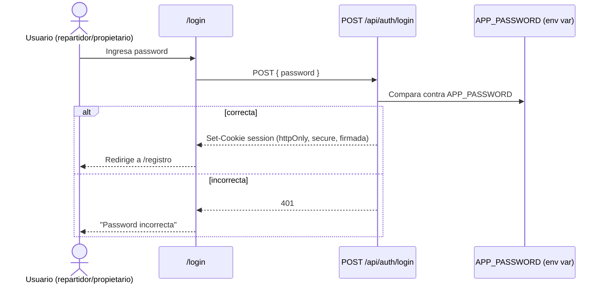

# Backend Architecture

## Service Architecture

**Traditional server** (contenedor Node persistente corriendo Next.js, no funciones serverless individuales) — coherente con el despliegue en VPS/Docker Compose elegido.

### Controller/Route Organization

```text
app/api/
├── auth/login/route.ts
├── auth/logout/route.ts
├── repartidores/route.ts
├── registros/route.ts
└── resumen/route.ts
```

### Controller Template

```typescript
// app/api/registros/route.ts
export async function POST(request: Request) {
  const body = registrosSchema.parse(await request.json()); // validación zod
  const resultado = await crearRegistros(body.repartidorId, body.numerosPedido);
  return Response.json(resultado, { status: 201 });
}
```

## Database Architecture

### Schema Design

Ver sección **Database Schema** arriba (fuente única del esquema).

### Data Access Layer

```typescript
// lib/db/registros.ts
export async function crearRegistros(repartidorId: string, numeros: number[]) {
  const tarifa = await obtenerTarifaVigente();
  const creados = [];
  const conflictos = [];
  for (const numeroPedido of numeros) {
    try {
      creados.push(
        await prisma.registroSalida.create({
          data: { repartidorId, numeroPedido, tarifaAplicada: tarifa },
        })
      );
    } catch (e) {
      const existente = await prisma.registroSalida.findUnique({ where: { numeroPedido } });
      conflictos.push({ numeroPedido, asignadoA: existente?.repartidorId });
    }
  }
  return { creados, conflictos };
}
```

## Authentication and Authorization

### Auth Flow



### Middleware/Guards

```typescript
// lib/auth.ts
export function verificarSesion(cookieValue: string | undefined): boolean {
  if (!cookieValue) return false;
  return verificarFirma(cookieValue, process.env.SESSION_SECRET!);
}
```
