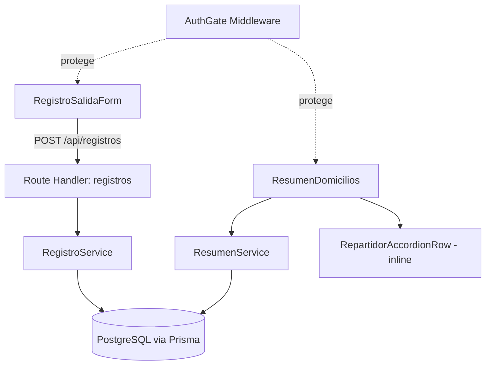

# Components

## AuthGate (middleware.ts)

**Responsibility:** Verifica cookie de sesión en cada request; redirige a `/login` si falta o es inválida.

**Key Interfaces:**
- Next.js Middleware (`middleware.ts`)

**Dependencies:** `lib/auth.ts`

**Technology Stack:** Next.js Middleware, cookie firmada (iron-session o JWT)

## RegistroSalidaForm (Client Component)

**Responsibility:** UI para que el repartidor seleccione su nombre e ingrese uno o varios números de pedido.

**Key Interfaces:**
- `POST /api/registros`

**Dependencies:** `components/ui/*` (shadcn), `lib/api-client.ts`

**Technology Stack:** React Client Component, shadcn/ui, Tailwind

## ResumenDomicilios (Server Component)

**Responsibility:** Muestra la tabla de repartidores con cantidad de pedidos y valor a pagar.

**Key Interfaces:**
- Lectura directa vía `lib/db/registros.ts` (Server Component, sin round-trip HTTP)

**Dependencies:** `lib/db/registros.ts`

**Technology Stack:** React Server Component

## RepartidorAccordionRow (Client Component)

**Responsibility:** Fila expandible de un repartidor dentro de `ResumenDomicilios`; al expandir, muestra los números de pedido y fecha/hora registrados a su nombre (ex "DetalleRepartidor"). _Actualizado tras validación de mockups (`docs/front-end-spec.md`): reemplaza la ruta separada `/resumen/[repartidorId]` — es un acordeón inline, no una página nueva._

**Key Interfaces:**
- Recibe los pedidos del repartidor como prop desde `ResumenDomicilios` (mismo fetch del Server Component padre, sin round-trip HTTP adicional)

**Dependencies:** `components/ui/accordion` (shadcn)

**Technology Stack:** React Client Component (necesita estado local de expandido/colapsado), shadcn/ui

## RegistroService (lib/services/registro.ts)

**Responsibility:** Valida duplicados (FR4/FR8) y crea registros de salida aplicando la tarifa vigente.

**Key Interfaces:**
- `crearRegistros(repartidorId, numerosPedido[]): { creados, conflictos }`

**Dependencies:** `lib/db/registros.ts`, `lib/tarifa.ts`

**Technology Stack:** TypeScript, Prisma

## ResumenService (lib/services/resumen.ts)

**Responsibility:** Agrega registros por repartidor y calcula el valor total a pagar.

**Key Interfaces:**
- `obtenerResumen(): ResumenPorRepartidor[]`

**Dependencies:** `lib/db/registros.ts`

**Technology Stack:** TypeScript, Prisma

## Component Diagrams

