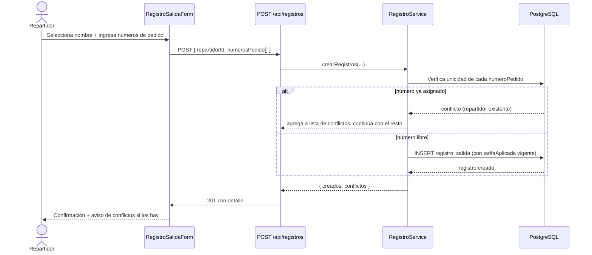
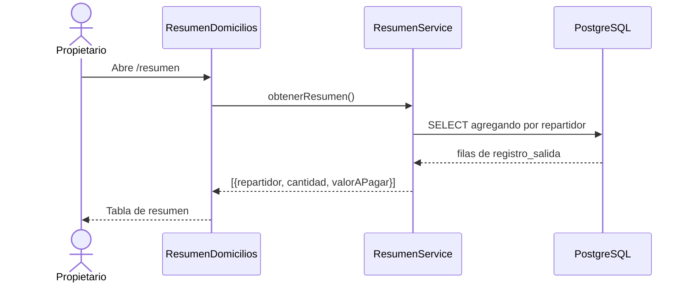

# Core Workflows

```mermaid
sequenceDiagram
    actor R as Repartidor
    participant UI as RegistroSalidaForm
    participant API as POST /api/registros
    participant SVC as RegistroService
    participant DB as PostgreSQL

    R->>UI: Selecciona nombre + ingresa números de pedido
    UI->>API: POST { repartidorId, numerosPedido[] }
    API->>SVC: crearRegistros(...)
    SVC->>DB: Verifica unicidad de cada numeroPedido
    alt número ya asignado
        DB-->>SVC: conflicto (repartidor existente)
        SVC-->>API: agrega a lista de conflictos, continúa con el resto
    else número libre
        SVC->>DB: INSERT registro_salida (con tarifaAplicada vigente)
        DB-->>SVC: registro creado
    end
    SVC-->>API: { creados, conflictos }
    API-->>UI: 201 con detalle
    UI-->>R: Confirmación + aviso de conflictos si los hay
```

```mermaid
sequenceDiagram
    actor P as Propietario
    participant UI as ResumenDomicilios
    participant SVC as ResumenService
    participant DB as PostgreSQL

    P->>UI: Abre /resumen
    UI->>SVC: obtenerResumen()
    SVC->>DB: SELECT agregando por repartidor
    DB-->>SVC: filas de registro_salida
    SVC-->>UI: [{repartidor, cantidad, valorAPagar}]
    UI-->>P: Tabla de resumen
```
