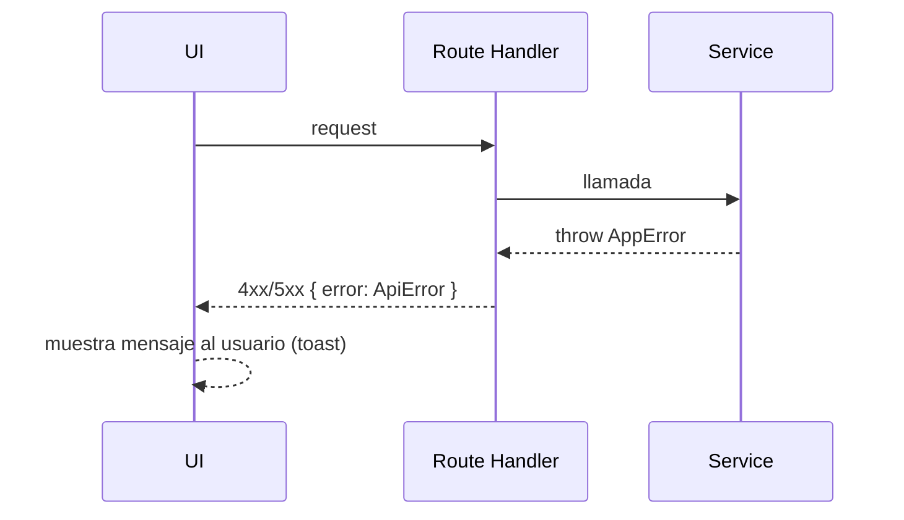

# Error Handling Strategy

## Error Flow



## Error Response Format

```typescript
interface ApiError {
  error: {
    code: string;
    message: string;
    details?: Record<string, any>;
    timestamp: string;
    requestId: string;
  };
}
```

## Frontend Error Handling

```typescript
try {
  await registrarSalida(repartidorId, numerosPedido);
} catch (e) {
  toast.error("No se pudo registrar la salida. Intenta de nuevo.");
}
```

## Backend Error Handling

```typescript
export async function POST(request: Request) {
  try {
    const body = registrosSchema.parse(await request.json());
    return Response.json(await crearRegistros(body.repartidorId, body.numerosPedido), { status: 201 });
  } catch (e) {
    return Response.json(
      { error: { code: "BAD_REQUEST", message: String(e), timestamp: new Date().toISOString(), requestId: crypto.randomUUID() } },
      { status: 400 }
    );
  }
}
```
