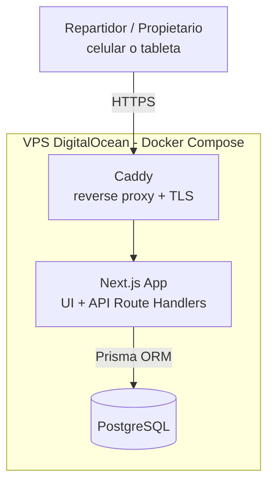

# High Level Architecture

## Technical Summary

Domicilios San Pedro se implementa como una aplicación monolítica full-stack sobre Next.js (App Router), donde el mismo proyecto sirve tanto la interfaz web responsive como los endpoints API (Route Handlers) consumidos por esa misma interfaz. Los datos se persisten en PostgreSQL, accedido mediante Prisma ORM, dentro de un contenedor Docker en un VPS de DigitalOcean, junto a Caddy como reverse proxy con HTTPS automático. No hay integraciones externas en el alcance del MVP: el sistema de caja (POS) permanece separado. Esta arquitectura simple y contenida cumple los objetivos del PRD — registro de salida sin fricción y resumen de domicilios en tiempo real — sin incurrir en la complejidad operativa de microservicios o múltiples proveedores.

## Platform and Infrastructure Choice

**Platform:** VPS propio en DigitalOcean (Droplet), desplegado vía Docker Compose.
**Key Services:** Droplet Ubuntu LTS (Docker Engine), contenedor Next.js (app + API), contenedor PostgreSQL, contenedor Caddy (reverse proxy + TLS automático vía Let's Encrypt).
**Deployment Host and Regions:** DigitalOcean, región NYC3 (baja latencia razonable hacia Colombia); una sola región es suficiente para el volumen de este MVP.

## Repository Structure

**Structure:** Repositorio único (single Next.js app) — no un monorepo multi-paquete clásico, ya que el App Router unifica frontend y API en el mismo proyecto. _Nota:_ esto ajusta la suposición inicial de "Monorepo" del PRD — aquí se simplifica a "un solo repo" porque no hay apps separadas (web/api) que orquestar.
**Monorepo Tool:** Ninguno por ahora. Se añadiría npm/pnpm workspaces solo si en el futuro aparece una segunda app (ej. una app móvil) que necesite compartir tipos vía un paquete `shared`.
**Package Organization:** Proyecto único con `app/` (rutas UI + route handlers API), `prisma/` (schema y migraciones), `lib/` (lógica de negocio: validación de duplicados, cálculo de resumen de domicilios).

## High Level Architecture Diagram

## Architectural Patterns

- **Monolito Full-Stack (Next.js App Router):** UI y API en el mismo proyecto y despliegue. _Rationale:_ app de 2 pantallas y equipo de desarrollo pequeño — separar frontend/backend en servicios distintos agregaría complejidad operativa sin beneficio real.
- **Component-Based UI:** Componentes React (Server + Client Components) reutilizables. _Rationale:_ mantenibilidad y consistencia entre Registro de Salida y Resumen de Domicilios.
- **Repository Pattern (via Prisma):** Acceso a datos encapsulado en funciones/módulos de `lib/`, no queries dispersas. _Rationale:_ facilita testing (mockear la capa de datos) y una futura migración de base de datos si fuera necesaria.
- **BFF implícito (Route Handlers):** Los endpoints API de Next.js actúan como backend-for-frontend, único punto de entrada consumido por la UI. _Rationale:_ no se requiere API pública externa ni API Gateway separado para el MVP.
- **Despliegue Containerizado (Docker Compose):** App, base de datos y reverse proxy como contenedores orquestados juntos. _Rationale:_ reproducible entre entorno local y VPS, y portable si se cambia de proveedor más adelante.
