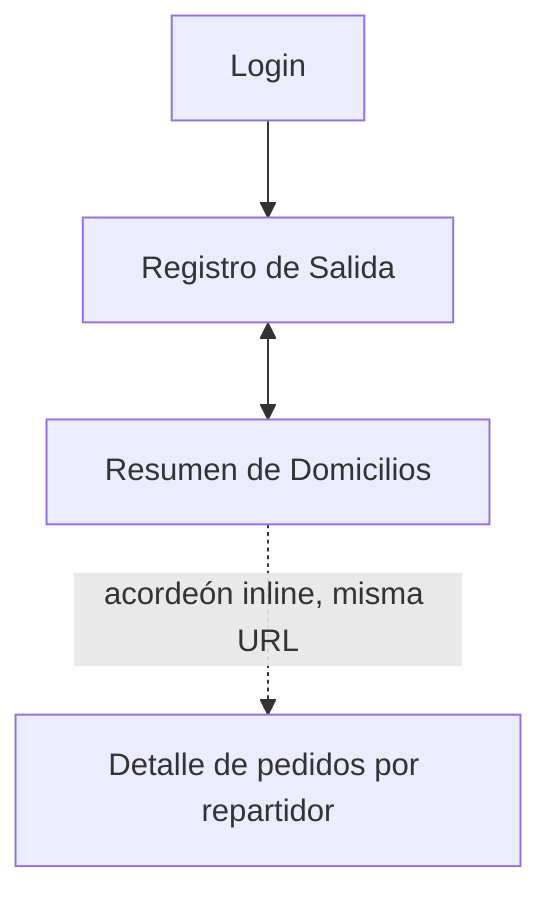
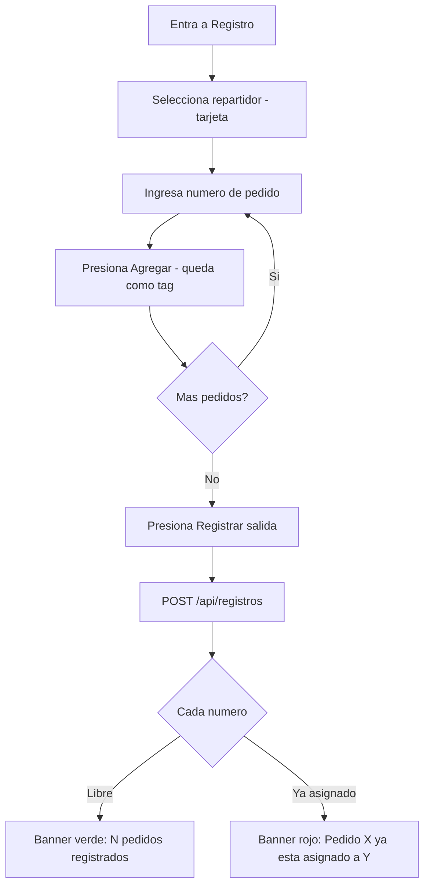
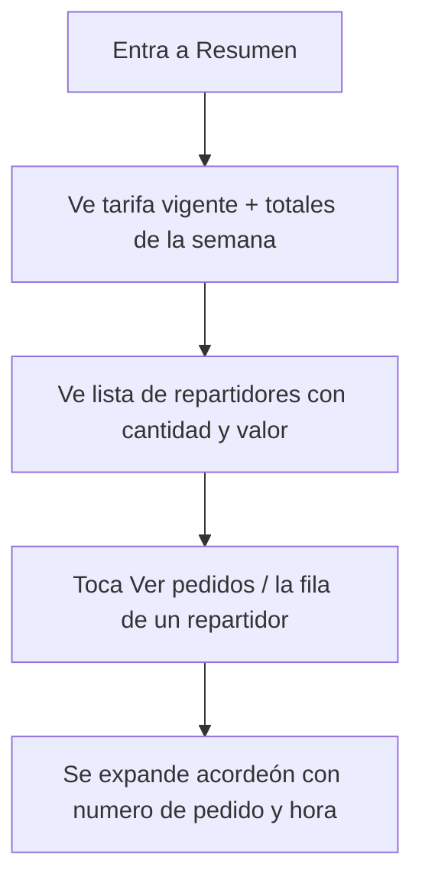

# Domicilios San Pedro UI/UX Specification

Este documento define las metas de experiencia de usuario, arquitectura de información, flujos y especificaciones de diseño visual para la interfaz de Domicilios San Pedro. Se basa en 2 mockups de alta fidelidad ya validados con el propietario (`mockups/mockup1.png` — Registro de Salida, `mockups/mockup2.png` — Resumen de Domicilios), por lo que las decisiones visuales aquí documentadas son extracción directa de esos mockups, no propuestas nuevas.

## Overall UX Goals & Principles

### Target User Personas

- **Repartidor (Carlos, Diego, Andrés):** usa la pantalla de Registro en movimiento, de pie, con prisa — prioridad absoluta es velocidad y cero fricción.
- **Propietario / Auxiliar de mostrador (Pedro / Martha):** usa la pantalla de Resumen para revisar pagos semanales y resolver dudas puntuales sobre quién tiene un pedido.

### Usability Goals

- Ease of learning: un repartidor completa su primer registro sin entrenamiento previo, en menos de 15 segundos (NFR1).
- Efficiency of use: seleccionar repartidor y agregar múltiples números de pedido como tags, sin recargar pantalla ni navegar.
- Error visibility: los conflictos de doble asignación se muestran de inmediato, en la misma pantalla, con el nombre exacto de quién ya tiene el pedido (validado en mockup1).
- Memorability: mismo patrón de tarjetas y misma navegación de 2 pestañas en toda la app — nada que reaprender entre pantallas.

### Design Principles

1. **Feedback inmediato y visible** — cada acción (registro exitoso, conflicto) se confirma con una tarjeta de estado in-situ (banner), no con un modal bloqueante.
2. **Selección sobre tecleo** — el repartidor se elige tocando una tarjeta, nunca escribiendo texto libre (confirmado en mockup1).
3. **Todo cabe en una pantalla** — el detalle de pedidos por repartidor es un acordeón expandible dentro de Resumen, no una navegación a otra página.
4. **Jerarquía visual por color** — verde/teal para éxito y elementos primarios, rojo/rosa para conflictos, gris para inactivo o no seleccionado.
5. **Progressive disclosure** — el detalle de pedidos por repartidor queda oculto hasta expandir, manteniendo el resumen inicial escaneable de un vistazo.

## Change Log

| Date | Version | Description | Author |
|------|---------|-------------|--------|
| 2026-07-22 | 0.1 | Spec inicial extraída de mockup1.png y mockup2.png (validados con el propietario) | Sally (UX Expert) |

## Information Architecture (IA)

### Site Map / Screen Inventory

### Navigation Structure

**Primary Navigation:** Bottom tab bar fijo con 2 ítems — "Registro" y "Resumen" — visible en ambas pantallas autenticadas (ver mockups, franja inferior).

**Secondary Navigation:** Ninguna. El detalle por repartidor es un acordeón inline dentro de la pantalla Resumen, no una navegación secundaria ni una página nueva.

**Breadcrumb Strategy:** No aplica — la profundidad de navegación es de un solo nivel (Login → Registro/Resumen).

> ⚠️ **Discrepancia con Architecture detectada:** `docs/architecture/frontend-architecture.md` y la Story 2.3 definen una ruta separada `/resumen/[repartidorId]` para el detalle por repartidor. El mockup validado con el cliente (mockup2.png) muestra ese detalle como un **acordeón expandible dentro de la misma pantalla `/resumen`**, sin cambiar de URL (ver Carlos expandido, Diego y Andrés colapsados en la misma vista). Se reconcilia esto en Architecture y Story 2.3 tras esta spec — ver Next Steps.

## User Flows

### Flow: Registrar salida (repartidor)

**User Goal:** Registrar uno o varios pedidos en menos de 15 segundos antes de salir.

**Entry Points:** Tab "Registro" (pantalla por defecto tras login).

**Success Criteria:** Banner verde confirmando "N pedidos registrados"; cualquier número ya asignado a otro repartidor queda excluido y señalado, sin bloquear el resto del lote.

#### Flow Diagram

#### Edge Cases & Error Handling:

- Número de pedido ya asignado a otro repartidor: banner rojo dismissable con el número exacto y el nombre del repartidor que ya lo tiene (no un mensaje genérico).
- Lote mixto (algunos números libres, uno duplicado): ambos banners aparecen simultáneamente — el verde con los que sí se guardaron, el rojo con el conflicto — según se ve en mockup1.
- Sin repartidor seleccionado: botón "Registrar salida" debe quedar deshabilitado (ya cubierto como test en Story 1.4).

**Notes:** El contador "N pedidos listos para registrar" (visible antes del botón en mockup1) actúa como confirmación previa a enviar — no estaba especificado en el PRD/Architecture original, se agrega en Next Steps.

### Flow: Consultar resumen y detalle (propietario / auxiliar)

**User Goal:** Ver cuánto pagar a cada repartidor y, si hace falta, revisar sus pedidos individuales.

**Entry Points:** Tab "Resumen".

**Success Criteria:** Totales de la semana visibles sin pasos adicionales; detalle de pedidos de un repartidor visible al expandir su fila, sin cambiar de pantalla.

#### Flow Diagram

#### Edge Cases & Error Handling:

- Repartidor sin pedidos esta semana: fila debe mostrar 0 pedidos / $0, no ocultarse (comportamiento a confirmar con el propietario).
- Lista larga de pedidos dentro de un acordeón expandido: debe permitir scroll interno sin romper el layout de la tarjeta.

**Notes:** Pendiente confirmar si el acordeón es exclusivo (un repartidor expandido a la vez) o independiente (varios expandidos simultáneamente) — el mockup solo muestra un estado congelado (Carlos expandido, los otros dos colapsados) y no distingue el comportamiento.

## Wireframes & Mockups

**Primary Design Files:** `mockups/mockup1.png` (Registro de Salida), `mockups/mockup2.png` (Resumen de Domicilios) — mockups estáticos de alta fidelidad, validados directamente con el propietario; no existen en una herramienta de diseño externa (Figma/Sketch).

### Registro de Salida

**Purpose:** Registrar la salida de uno o varios pedidos con la mínima fricción posible.

**Key Elements:**
- Selector de repartidor: 3 tarjetas horizontales (avatar + nombre), la seleccionada se resalta con borde verde y check.
- Input de número de pedido + botón "Agregar", con los números ya ingresados como tags removibles (X).
- Contador "N pedidos listos para registrar" con chevron, antes del botón principal.
- Botón primario "Registrar salida" (verde, ancho completo, ícono de enviar).
- Banners de resultado apilados debajo del botón: rojo para conflicto, verde para éxito, ambos dismissables con X.

**Interaction Notes:** Selección de repartidor es de una sola tarjeta a la vez (no múltiple). Los tags de pedido se eliminan individualmente tocando su X. Los banners de resultado no bloquean la pantalla — el usuario puede seguir registrando mientras los ve.

**Design File Reference:** `mockups/mockup1.png`

### Resumen de Domicilios

**Purpose:** Dar visibilidad inmediata del pago semanal por repartidor y permitir consultar el detalle cuando haga falta.

**Key Elements:**
- Card "Tarifa vigente" ($1.000 COP por domicilio) — visible arriba de todo, informativa.
- Card de totales agregados de la semana: cantidad total de pedidos + valor total a pagar (suma de todos los repartidores).
- Lista de repartidores, cada uno con: cantidad de pedidos, valor a pagar, botón "Ver pedidos" y chevron de expandir/colapsar.
- Acordeón expandido: tabla inline "Pedidos de {repartidor}" con número de pedido + hora de registro por fila.

**Interaction Notes:** El repartidor expandido (Carlos en el mockup) muestra la lista de sus pedidos inline, sin navegar a otra pantalla ni cambiar la URL. Los repartidores colapsados (Diego, Andrés) solo muestran su resumen de cantidad/valor.

**Design File Reference:** `mockups/mockup2.png`

## Component Library / Design System

**Design System Approach:** No existía un design system previo. Se define aquí un set mínimo de componentes extraído de los mockups, implementado sobre shadcn/ui + Tailwind CSS (decisión ya tomada en `docs/architecture/tech-stack.md`).

### RepartidorCard

**Purpose:** Selector táctil de repartidor en la pantalla de Registro.

**Variants:** default (avatar gris), seleccionado (borde y check verde).

**States:** default, selected, disabled (repartidor inactivo).

**Usage Guidelines:** Nunca reemplazar por un `<select>` de texto ni input libre — la selección por tarjeta es un principio de diseño validado, no un detalle estético.

### PedidoTag

**Purpose:** Mostrar un número de pedido ya ingresado, con opción de quitarlo.

**Variants:** normal (fondo verde claro).

**States:** default, removido (al tocar la X).

**Usage Guidelines:** Cada tag es independiente; quitar uno no afecta a los demás.

### StatusBanner

**Purpose:** Feedback inmediato tras registrar una salida.

**Variants:** éxito (verde), conflicto/error (rojo).

**States:** visible, dismissed (al tocar la X).

**Usage Guidelines:** Pueden coexistir varios banners a la vez (un lote puede generar éxito y conflicto simultáneamente); nunca reemplazar por un solo mensaje genérico que oculte el detalle de qué pedido específico falló.

### SummaryCard

**Purpose:** Mostrar una métrica agregada (tarifa vigente, totales de la semana).

**Variants:** single-stat (ej. "Tarifa vigente"), dual-stat (ej. "34 pedidos / $34.000").

**States:** N/A (solo lectura).

### RepartidorAccordionRow

**Purpose:** Fila expandible de repartidor en Resumen, con su detalle de pedidos inline.

**States:** colapsado, expandido.

**Usage Guidelines:** Expandir no debe recargar la página ni navegar — es un cambio de estado local en el cliente.

### BottomTabBar

**Purpose:** Navegación principal fija entre Registro y Resumen.

**States:** tab activo (verde + subrayado), tab inactivo (gris).

## Branding & Style Guide

> ⚠️ **Discrepancia con PRD detectada:** `docs/prd/user-interface-design-goals.md` establece "Branding: No se mencionaron elementos de marca... interfaz neutra y funcional". Los mockups validados SÍ muestran una marca definida: logo (ícono de casa con cruz), nombre "Domicilios San Pedro" con subtítulo "Droguería", y paleta verde/teal consistente. Se actualiza el PRD tras esta spec — ver Next Steps.

### Visual Identity

**Brand Guidelines:** Extraídos directamente de los mockups validados (no existe un manual de marca separado). Logo: ícono de casa con una cruz dentro (alude a droguería/farmacia), acompañado del nombre "Domicilios San Pedro" y el subtítulo "Droguería".

### Color Palette

| Color Type | Hex Code (aprox., extraído del mockup) | Usage |
|------------|------|-------|
| Primary | `#0F9D8B` (verde-teal) | Botón "Registrar salida", tab activo, check de selección, montos destacados |
| Secondary | `#D1FAE5` (verde claro) | Fondo de tags de pedido, fondo de banners de éxito |
| Accent | `#0F9D8B` (mismo verde) | Íconos de acento (etiqueta de tarifa, paquete) |
| Success | `#0F9D8B` / fondo `#ECFDF5` | Banner "N pedidos registrados" |
| Warning | _No se observa un warning distinto de error en los mockups_ | Pendiente definir si surge un caso de uso futuro |
| Error | `#F43F5E` (rosa/rojo) sobre fondo `#FEE2E2` | Banner de conflicto "Pedido ya está asignado a X" |
| Neutral | Grises (`#6B7280` texto secundario, `#E5E7EB` bordes, `#9CA3AF` avatar inactivo) | Texto secundario, bordes de tarjetas, avatares de repartidor no resaltado |

### Typography

#### Font Families

- **Primary:** Sans-serif del sistema (estilo SF Pro / Inter), consistente con la fuente nativa de iOS visible en los mockups.
- **Secondary:** N/A — no se observan familias tipográficas adicionales.
- **Monospace:** N/A — no requerido para esta app (sin bloques de código visibles al usuario).

#### Type Scale

| Element | Size | Weight | Line Height |
|---------|------|--------|-------------|
| H1 (título de pantalla) | ~28px | Bold | 1.2 |
| H2 (título de sección/card) | ~18px | Semibold | 1.3 |
| Body | ~16px | Regular | 1.4 |
| Small (subtítulos, metadatos) | ~14px | Regular | 1.4 |

### Iconography

**Icon Library:** Set de íconos lineales tipo outline (persona, documento, paquete/caja, etiqueta de precio, gráfico de barras, check, alerta triangular, ojo) — consistente con **Lucide Icons**, el set que shadcn/ui incluye por defecto (encaja de forma natural con el stack ya decidido en Architecture, sin librería adicional que instalar).

**Usage Guidelines:** Íconos siempre acompañados de texto (nunca solo-ícono, salvo la X de descarte de tags/banners); color del ícono sigue el mismo verde/rojo/gris del contexto (éxito, error, neutral).

### Spacing & Layout

**Grid System:** Layout de una sola columna en mobile, basado en tarjetas (cards) con esquinas redondeadas y padding generoso — sin grid multi-columna visible en los mockups.

**Spacing Scale:** Escala consistente con Tailwind por defecto (4px base: 4/8/12/16/24/32) — el padding interno de las cards en el mockup es visualmente ~16-24px.

## Accessibility Requirements

### Compliance Target

**Standard:** Ninguno formal (PRD fija explícitamente "Accessibility: None" para el MVP, dado el contexto de equipo interno reducido).

### Key Requirements

**Visual:**
- Color contrast ratios: mantener igual o mejor contraste que el observado en los mockups (verde `#0F9D8B` sobre blanco ya cumple AA por defecto; no se exige verificación formal).
- Focus indicators: los que trae shadcn/ui (Radix) por defecto, sin personalización adicional requerida.
- Text sizing: seguir el Type Scale definido arriba, sin requisito de escalado dinámico.

**Interaction:**
- Keyboard navigation: la que shadcn/ui (Radix) provee de fábrica en sus primitives (Select, Button) — no se requiere trabajo adicional.
- Screen reader support: no es un requisito formal para el MVP; se beneficia igual de los roles ARIA que trae Radix.
- Touch targets: mantener el tamaño grande de tarjetas y botones ya validado en los mockups (favorece uso apurado, no solo accesibilidad).

**Content:**
- Alternative text: no aplica — no hay imágenes de contenido, solo íconos decorativos con texto adyacente.
- Heading structure: H1 por pantalla ("Registro de salida", "Resumen de domicilios"), H2 por sección/card.
- Form labels: cada input (selector de repartidor, campo de número de pedido) debe tener label visible, tal como se ve en los mockups.

### Testing Strategy

Ninguna prueba de accesibilidad formal para el MVP (consistente con la decisión de producto en el PRD); se confía en las garantías por defecto de shadcn/ui + Radix.

## Responsiveness Strategy

### Breakpoints

| Breakpoint | Min Width | Max Width | Target Devices |
|------------|-----------|-----------|-----------------|
| Mobile | 320px | 599px | Celular del repartidor (target principal, según mockups) |
| Tablet | 600px | 1023px | Tableta compartida cerca de la salida (mencionada en PRD) |
| Desktop | 1024px | - | Uso no prioritario, no debe romperse |

### Adaptation Patterns

**Layout Changes:** El selector de repartidor ya es de 3 columnas horizontales incluso en mobile angosto (390px del mockup); en tablet solo crece el espaciado, no la cantidad de columnas. Las cards de Resumen mantienen una columna en todos los tamaños.

**Navigation Changes:** El bottom tab bar se mantiene igual en mobile y tablet — es un patrón mobile-first que también funciona bien en tableta sostenida o apoyada.

**Content Priority:** En todos los tamaños, la acción principal (seleccionar repartidor + registrar) queda en la mitad superior de la pantalla, sin scroll necesario para el caso típico de 1-3 pedidos.

**Interaction Changes:** Ninguna diferencia funcional entre mobile y tablet — mismos componentes, mismo comportamiento táctil.

## Animation & Micro-interactions

### Motion Principles

Sutil y funcional, nunca decorativo — coherente con un contexto de uso apurado (repartidor con casco puesto, en la puerta).

### Key Animations

- **Selección de repartidor:** transición de borde y check (Duration: 150ms, Easing: ease-out)
- **Aparición de banner de resultado:** fade + slide-in corto tras la respuesta del servidor (Duration: 200ms, Easing: ease-out)
- **Expandir/colapsar acordeón de repartidor:** expansión de altura suave (Duration: 200ms, Easing: ease-in-out)

## Performance Considerations

### Performance Goals

- **Page Load:** menor a 2s en conexión 3G/4G intermitente (coherente con NFR3 del PRD).
- **Interaction Response:** selección de repartidor y agregado de tag, percibido como instantáneo (<100ms).
- **Animation FPS:** 60fps — animaciones simples de CSS, sin JS pesado.

### Design Strategies

Server Components para la pantalla de Resumen (ya decidido en `docs/architecture/frontend-architecture.md`) reducen el JS enviado al cliente. Iconografía SVG liviana (Lucide). Sin imágenes de contenido pesadas — toda la UI es texto + íconos vectoriales + color plano.

## Next Steps

### Immediate Actions

1. Actualizar `docs/prd/user-interface-design-goals.md` (sección Branding) para reflejar la marca real validada en los mockups (logo, nombre, paleta verde/teal) en vez de "interfaz neutra sin marca".
2. Reconciliar `docs/architecture/frontend-architecture.md` y `docs/stories/2.3.story.md`: reemplazar la ruta separada `/resumen/[repartidorId]` por un acordeón inline dentro de `/resumen`, acorde al mockup validado.
3. Actualizar `docs/stories/2.2.story.md` para incluir la card de "Tarifa vigente" y la card de totales agregados de la semana — visibles en el mockup pero no en el AC original.
4. Confirmar con el propietario el comportamiento exacto del acordeón de Resumen: ¿un repartidor expandido a la vez, o varios simultáneamente?
5. Confirmar si un repartidor sin pedidos en la semana debe listarse con "0 pedidos / $0" o quedar oculto.

### Design Handoff Checklist

- [x] All user flows documented
- [x] Component inventory complete
- [x] Accessibility requirements defined
- [x] Responsive strategy clear
- [x] Brand guidelines incorporated
- [x] Performance goals established

## Checklist Results

No existe un checklist de UI/UX dedicado en `.bmad-core/checklists/` (solo `architect-checklist` y `po-master-checklist`) — se omite la ejecución formal de un checklist. Las discrepancias detectadas contra PRD y Architecture quedan documentadas arriba, en Next Steps, para que PM y Architect las resuelvan.
