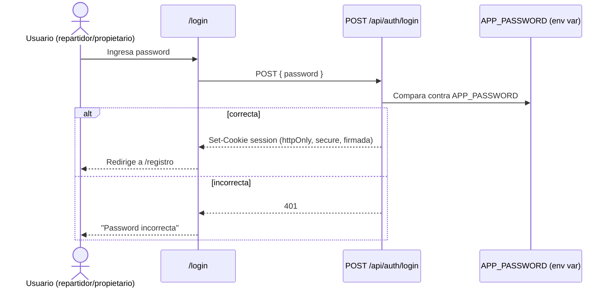

# Story 1.2: Autenticación con Password Compartida

## Status

Draft

## Story

**As a** propietario de la droguería,
**I want** que la aplicación pida una clave antes de dejar entrar a cualquiera,
**so that** el sistema no quede abierto a cualquiera que encuentre la URL en internet.

## Acceptance Criteria

1. Existe una pantalla de login que pide una única clave (password compartida, sin usuarios individuales).
2. Si la clave es correcta, se otorga una sesión (cookie firmada, httpOnly, secure) que da acceso a las demás pantallas.
3. Si la clave es incorrecta, se muestra un mensaje de error y no se otorga sesión.
4. Cualquier pantalla del sistema (Registro de Salida, Resumen de Domicilios, Detalle por Repartidor) redirige a login si no hay sesión válida.
5. La clave se configura mediante variable de entorno, no está escrita en el código.
6. Existe un límite de intentos de login por minuto para dificultar ataques de fuerza bruta sobre la clave única.

## Tasks / Subtasks

- [ ] Task 1: Crear pantalla de login (AC: 1, 3)
  - [ ] Página `app/login/page.tsx` con formulario de una sola clave [Source: architecture/frontend-architecture.md#component-organization]
  - [ ] Mostrar mensaje de error si la clave es incorrecta (respuesta 401) [Source: architecture/backend-architecture.md#auth-flow]
- [ ] Task 2: Implementar endpoint de login (AC: 2, 3, 5)
  - [ ] `app/api/auth/login/route.ts`: compara `password` recibido contra `APP_PASSWORD` (env var vía `lib/config.ts`) [Source: architecture/api-specification.md#rest-api-specification]
  - [ ] Si correcta: emitir cookie de sesión firmada (`httpOnly`, `secure`, `sameSite=strict`) [Source: architecture/security-and-performance.md#security-requirements]
  - [ ] Si incorrecta: responder 401 sin otorgar cookie [Source: architecture/backend-architecture.md#auth-flow]
- [ ] Task 3: Implementar verificación de sesión (AC: 2, 4)
  - [ ] `lib/auth.ts`: función `verificarSesion(cookieValue)` que valida firma HMAC con `SESSION_SECRET` [Source: architecture/backend-architecture.md#middlewareguards]
  - [ ] `middleware.ts`: redirige a `/login` si no hay sesión válida, para cualquier ruta excepto `/login` [Source: architecture/frontend-architecture.md#protected-route-pattern]
- [ ] Task 4: Endpoint de logout
  - [ ] `app/api/auth/logout/route.ts`: invalida la cookie de sesión [Source: architecture/api-specification.md#rest-api-specification]
- [ ] Task 5: Rate limiting en login (AC: 6)
  - [ ] Límite de intentos por IP en `/api/auth/login` (ej. 5/min) [Source: architecture/security-and-performance.md#security-requirements]
- [ ] Task 6: Tests
  - [ ] Test de integración: login con clave correcta emite cookie; login con clave incorrecta responde 401 [Source: architecture/testing-strategy.md#test-organization]
  - [ ] Test de middleware: ruta protegida sin sesión redirige a `/login` [Source: architecture/testing-strategy.md]

## Dev Notes

### Previous Story Insights

[Source: docs/stories/1.1.story.md] Story 1.1 deja el proyecto Next.js base desplegado con Docker Compose, `lib/config.ts` como puerta de entrada a variables de entorno, y Vitest configurado — esta historia reutiliza esa base, no la reconfigura.

### Auth Flow

[Source: architecture/backend-architecture.md#authentication-and-authorization]



Middleware/Guards de referencia:
```typescript
// lib/auth.ts
export function verificarSesion(cookieValue: string | undefined): boolean {
  if (!cookieValue) return false;
  return verificarFirma(cookieValue, process.env.SESSION_SECRET!);
}
```

### API Specification

[Source: architecture/api-specification.md#rest-api-specification]

- `POST /api/auth/login` — body `{ password: string }` → 200 (cookie emitida) | 401 (password incorrecta)
- `POST /api/auth/logout` — 200 (cookie invalidada)

### Security Requirements

[Source: architecture/security-and-performance.md#security-requirements]

- Token Storage: cookie de sesión firmada (HMAC con `SESSION_SECRET`), nunca en localStorage.
- Session Management: expiración larga (ej. 30 días) — dispositivo compartido cerca de la salida.
- Rate Limiting: límite estricto de intentos en `/api/auth/login` (ej. 5/min por IP) dado que es una password única compartida.
- Password Policy: password única en variable de entorno, rotable manualmente por el propietario.

### Routing

[Source: architecture/frontend-architecture.md#routing-architecture]

```text
/login              - Login (password única)
/registro           - Registro de Salida (home tras login)
/resumen            - Resumen de Domicilios
/resumen/[id]        - Detalle de pedidos por repartidor
```

Patrón de ruta protegida (middleware.ts) ya definido en architecture; esta historia lo implementa por primera vez — todas las páginas futuras (Story 1.4, 2.2, 2.3) dependen de él.

### File Locations

- `app/login/page.tsx` (nuevo)
- `app/api/auth/login/route.ts` (nuevo)
- `app/api/auth/logout/route.ts` (nuevo)
- `lib/auth.ts` (nuevo)
- `middleware.ts` (nuevo, raíz del proyecto)

[Source: architecture/unified-project-structure.md]

### Testing

[Source: architecture/testing-strategy.md]

- Test de integración sobre `/api/auth/login` (clave correcta/incorrecta).
- Test de middleware verificando redirección a `/login` sin sesión.
- No requiere test E2E (fuera de alcance del MVP).

## Change Log

| Date | Version | Description | Author |
|------|---------|-------------|--------|
| 2026-07-22 | 0.1 | Story creada por SM a partir de Epic 1 sharded | Bob (SM) |

## Dev Agent Record

### Agent Model Used

_Pendiente — se completa durante implementación._

### Debug Log References

_Pendiente._

### Completion Notes List

_Pendiente._

### File List

_Pendiente._

## QA Results

_Pendiente — se completa tras revisión de QA._
